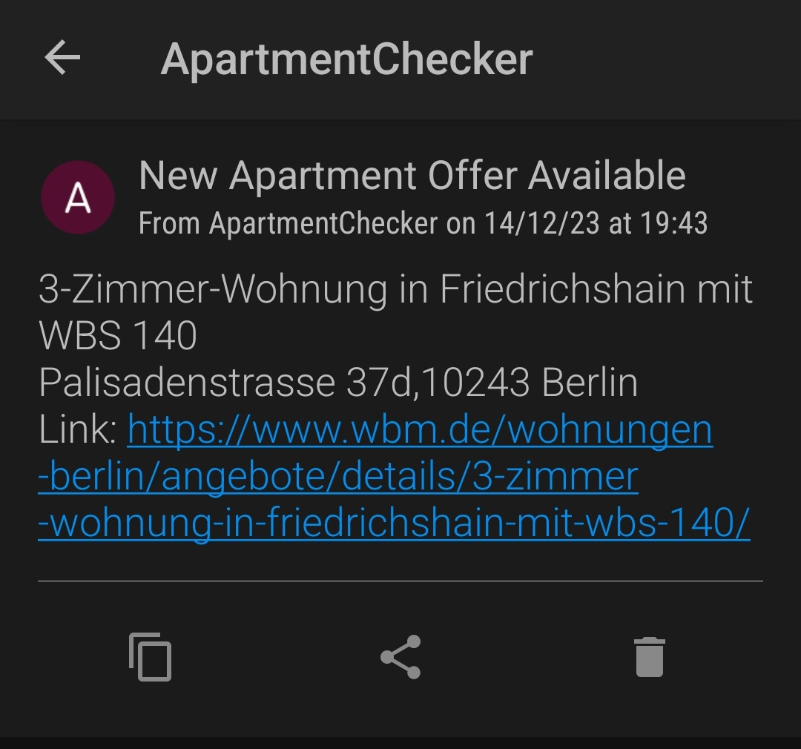
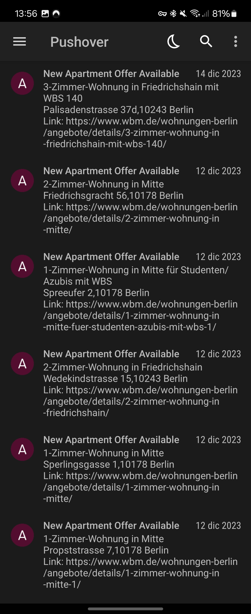

# Apartment Monitoring Script

This script continuously monitors the "WBM Wohnungen Berlin" website for new apartment listings. When a new listing is detected, it sends a notification through Pushover to the configured user.

## Features

- Monitors apartment listings at scheduled intervals.
- Logs status updates and errors to the console.
- Sends push notifications when new apartments are available.
- Prevents duplicate notifications for the same apartment listing.

## Screenshot 1

## Screenshot 2

## Prerequisites

- Node.js
- Puppeteer
- Pushover account for notification delivery

## Set up environment variables:

Create a .env file in the root directory and add your Pushover user key and API token:

PUSHOVER_USER=your_pushover_user_key
PUSHOVER_TOKEN=your_pushover_api_token
